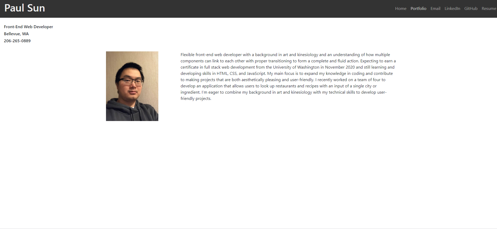
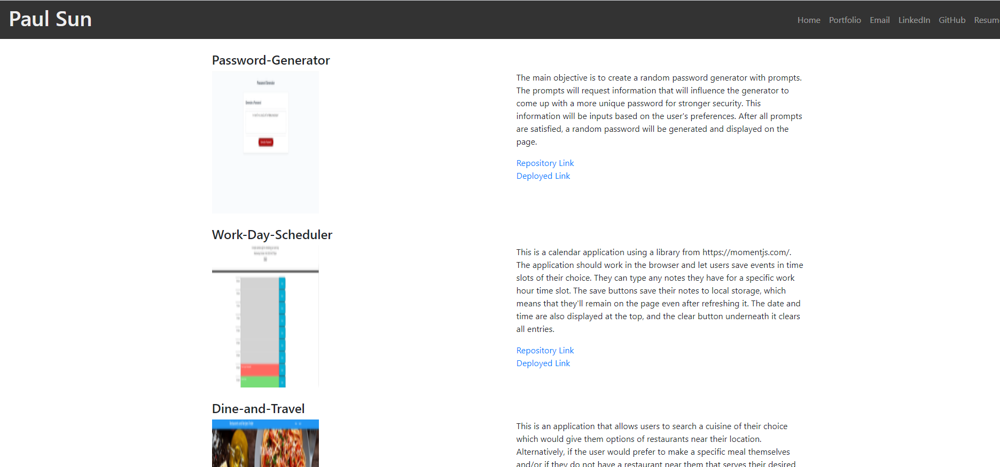

# Portfolio

## Description

This is my portfolio site. It will include my name, contact information, and links to my GitHub profile and LinkedIn page. I will also add a list of three of my best projects in the portfolio page and have information on each project, such as descriptions, screenshots, and links, in the projects page. The goal is to highlight my skills and knowledge in coding.

## Screenshots

## Links

* https://github.com/LostandConfusedStudent/Portfolio
* https://lostandconfusedstudent.github.io/Portfolio/